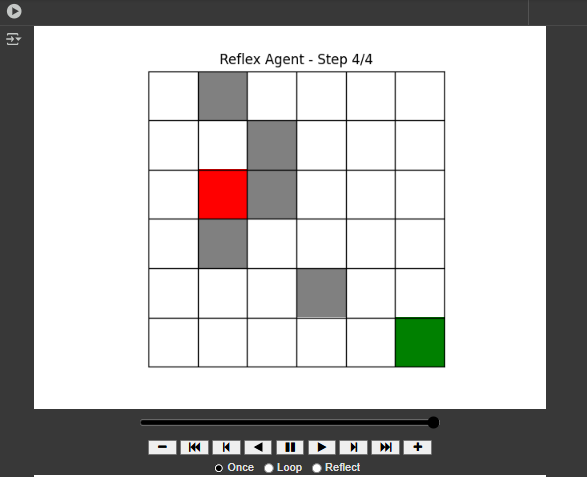
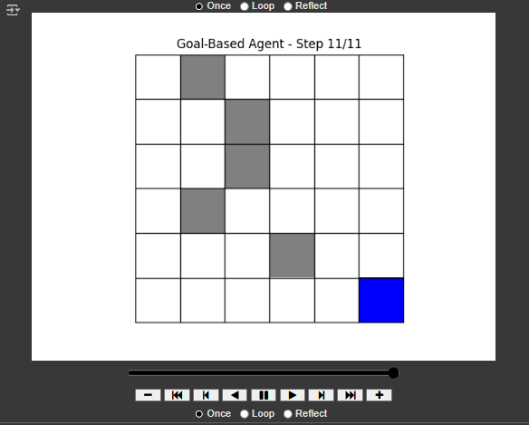

# Multi-Agent Grid Simulation

## Description

This project demonstrates **two types of agents navigating a grid world**:

1. **Reflex Agent**: Moves greedily (right → down) without considering obstacles optimally.  
2. **Goal-Based Agent**: Uses the **A\* algorithm** to find the shortest path to the goal while avoiding obstacles.

The grid world is a 6x6 matrix with obstacles, a start point, and a goal. The simulation visually shows the steps each agent takes to reach the goal.  

This project is ideal for learning **Artificial Intelligence concepts**, such as reflex agents, goal-based agents, and pathfinding algorithms.  

---

## Features

- 6x6 grid environment with obstacles.
- Reflex agent path simulation.
- Goal-based agent path simulation using A*.
- Animated visualization of both agents.
- Step count comparison for efficiency analysis.

---
1. **Reflex Agent**: Moves greedily (right → down) without considering obstacles optimally.
   ------------------------------------------------------

   ------------------------------------------------------
3. **Goal-Based Agent**: Uses the **A\* algorithm** to find the shortest path to the goal while avoiding obstacles.
4.    ------------------------------------------------------


## Getting Started

### Prerequisites

- Python 3.8+
- Jupyter Notebook or any environment that supports `IPython.display`.
- Libraries: `numpy`, `matplotlib`

Install dependencies:

```bash
pip install numpy matplotlib
